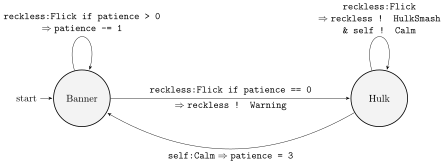

# Hulk
Implementation of a simple agent behaviour as a Akka FSM in Scala. 

## How does Hulk behave ?

The agent called `bruce` has an internal `patience` variable that determines his level of patience. The initial state of Bruce is `Banner`. As long as he has patience left, Bruce agrees to receive the `Flick` message from the `reckless` agent but loses patience. When his patience is exhausted and he receives a flick, Bruce switches to the `Hulk` state and sends a `Warning` message to the reckless agent. In the state Hulk, Bruce always responds to a flick with a `HulkSmash` and then he sends a `Calm` message to himself. When Bruce receives this message, he resets his patience variable and returns to the Banner state.

## Usage

Clone

    git clone https://github.com/maximemorge/Hulk

Compile 

    sbt compile

then

    sbt run

## About

For more information on the FSM design pattern in Scala Akka, see https://doc.akka.io/docs/akka/current/fsm.html

## Contributors

Copyright (C) Quentin BAERT and Maxime MORGE 2019

## License

This program is free software: you can redistribute it and/or modify it under the terms of the
GNU General Public License as published by the Free Software Foundation, either version 3 of the License,
or (at your option) any later version.

This program is distributed in the hope that it will be useful, but WITHOUT ANY WARRANTY;
without even the implied warranty of MERCHANTABILITY or FITNESS FOR A PARTICULAR PURPOSE.
See the GNU General Public License for more details.

You should have received a copy of the GNU General Public License along with this program.
If not, see <http://www.gnu.org/licenses/>.
